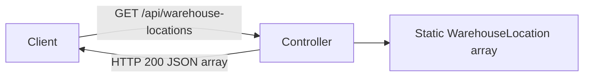

<!-- markdownlint-disable-file -->
# Task Research: Warehouse Location Controller

Research how this API should add a controller that returns warehouse location information using stubbed data.

## Task Implementation Requests

* Identify the existing API and test conventions relevant to a new controller
* Recommend a concrete stub-data endpoint design for warehouse location information

## Scope and Success Criteria

* Scope: Controller setup, route, response schema, dependency setup, and integration-test patterns in the current workspace
* Exclusions: Persistence, authentication, filtering, and capacity calculations
* Assumptions: Stubbed, read-only data is sufficient; no existing client contract dictates a route or schema
* Success Criteria:
  * The design follows the existing API's JSON and integration-test conventions
  * The endpoint responds with a deterministic JSON array and HTTP 200
  * The document selects one minimal implementation approach and gives actionable next steps

## Outline

1. Verified repository conventions
2. Endpoint design and implementation example
3. Alternative analysis and selected approach
4. Test and validation guidance

## Potential Next Research

* Confirm the public location schema and route with the API consumer
  * Reasoning: The current repository defines neither a warehouse-location contract nor a route convention
  * Reference: README.md:1-2
* Install the .NET 8 runtime before runtime endpoint verification
  * Reasoning: Both projects target `net8.0`, and the test host cannot currently execute
  * Reference: WarehouseWebApi.Tests/WarehouseWebApi.Tests.csproj:1-8

## Research Executed

### File Analysis

* README.md:1-2
  * Identifies the workspace only as a demo warehouse API; it defines no endpoint, schema, or architecture convention
* WarehouseWebApi/Program.cs:1-24
  * Creates a minimal `WebApplication`, maps only `GET /weatherforecast`, and has no MVC service registration or controller endpoint mapping
* WarehouseWebApi/Program.cs:26-32
  * Keeps `public partial class Program` for integration-test hosting and declares the sole file-local model
* WarehouseWebApi.Tests/WarehouseControllerTests.cs:9-71
  * Uses xUnit with `WebApplicationFactory<Program>`, `HttpClient`, `ReadFromJsonAsync`, and test-local response DTOs
* WarehouseWebApi.Tests/WarehouseWebApi.Tests.csproj:1-29
  * Targets `net8.0` and references ASP.NET Core's integration-test host with xUnit

### Code Search Results

* `Controllers`, `AddControllers`, and `MapControllers`
  * No application source matches; controller infrastructure is not yet enabled
* `WarehouseLocation`
  * No application source matches; a new public response model is required

### Project Conventions

* The successful minimal endpoint returns a bare record array rather than an envelope in WarehouseWebApi/Program.cs:12-22
* No serializer options are registered, so controller output should retain ASP.NET Core's default web JSON naming policy
* No `.github/copilot-instructions.md` exists in this workspace
* Research source: .copilot-tracking/research/subagents/2026-09-17/warehouse-location-controller-codebase-research.md

## Key Discoveries

### Project Structure

The API is a minimal ASP.NET Core application, not an MVC application. It has no
controllers, models folder, services, repositories, or persistence layer. The
new controller requires both `builder.Services.AddControllers()` and
`app.MapControllers()`; without either, its route cannot serve requests.

The existing test setup already supports the needed integration test. Retaining
the `public partial class Program` declaration is essential because the test
fixture references that entry point.

### Implementation Patterns

The current `/weatherforecast` endpoint owns in-memory data locally and returns
the array directly. Stubbed warehouse locations should likewise be deterministic
and return a plain JSON array. Unlike weather data, location values must not be
random because the integration contract should be stable.

Use PascalCase for C# members. ASP.NET Core's controller JSON serialization
emits the public contract as camel case: `id`, `zone`, `aisle`, `rack`, and
`shelf`.

### Complete Examples

Add controller support to WarehouseWebApi/Program.cs after creating the builder
and before starting the application:

```csharp
var builder = WebApplication.CreateBuilder(args);

builder.Services.AddControllers();

var app = builder.Build();

app.UseHttpsRedirection();

// Keep the existing weather endpoint here.

app.MapControllers();

app.Run();
```

Add WarehouseWebApi/Models/WarehouseLocation.cs:

```csharp
namespace WarehouseWebApi.Models;

public sealed record WarehouseLocation(
    string Id,
    string Zone,
    string Aisle,
    int Rack,
    int Shelf);
```

Add WarehouseWebApi/Controllers/WarehouseLocationsController.cs:

```csharp
using Microsoft.AspNetCore.Mvc;
using WarehouseWebApi.Models;

namespace WarehouseWebApi.Controllers;

[ApiController]
[Route("api/warehouse-locations")]
public sealed class WarehouseLocationsController : ControllerBase
{
    private static readonly WarehouseLocation[] Locations =
    {
        new("RCV-A-01-01", "Receiving", "A", 1, 1),
        new("STO-B-03-02", "Storage", "B", 3, 2),
        new("SHP-C-01-04", "Shipping", "C", 1, 4)
    };

    [HttpGet]
    public ActionResult<IReadOnlyList<WarehouseLocation>> Get()
    {
        return Ok(Locations);
    }
}
```

## Technical Scenarios

### Stubbed Location Listing Endpoint

The controller route should be explicit: `GET /api/warehouse-locations`. This
avoids the less-readable route generated by `[Route("api/[controller]")]`
(`api/warehouselocations`) and no established controller convention conflicts
with this choice.

**Requirements:**

* Register MVC controller services and map controller endpoints
* Return static location data with a documented five-field shape
* Preserve the existing minimal endpoint and integration-test entry point
* Add a route-level test for HTTP 200 and the returned schema

**Preferred Approach:**

* Use a public `WarehouseLocation` record and a controller-local immutable stub list. It is the smallest design that matches the existing local in-memory data pattern and gives callers a stable named contract.

```text
WarehouseWebApi/
  Controllers/WarehouseLocationsController.cs
  Models/WarehouseLocation.cs
  Program.cs
WarehouseWebApi.Tests/
  WarehouseControllerTests.cs
```



**Implementation Details:**

Use `Ok(Locations)` to make the controller's successful HTTP result explicit
while retaining the bare-array response convention. Do not configure JSON
options: the default web serializer already maps PascalCase C# properties to
camel-case JSON and `ReadFromJsonAsync` in the test host supports that mapping.

#### Considered Alternatives

| Option | Benefits | Limitations | Decision |
| --- | --- | --- | --- |
| Controller-local stub list | Minimal surface area; deterministic; matches the in-memory ownership of the existing endpoint | Couples static data and HTTP action; extraction will be needed if reuse appears | Selected for the stub-only request |
| Injected repository or service | Separates retrieval from HTTP and makes later persistence replacement straightforward | Creates an abstraction, DI registration, and test burden with no current consumer or behavior to justify them | Defer until there is a second consumer, persistence, filtering, or nontrivial retrieval logic |

For the deferred repository alternative, define an `IWarehouseLocationRepository`
only when there is a real data-boundary need. Register a stub implementation as
a singleton, inject it into the controller, and preserve the same response
model and integration test.

## Test and Validation Guidance

Extend WarehouseWebApi.Tests/WarehouseControllerTests.cs using its existing
fixture. Keep the response DTO test-local, as the current weather test does.

```csharp
[Fact]
public async Task GetWarehouseLocations_ReturnsStubbedLocations()
{
    var client = _factory.CreateClient();

    var response = await client.GetAsync("/api/warehouse-locations");

    Assert.Equal(HttpStatusCode.OK, response.StatusCode);

    var locations = await response.Content
        .ReadFromJsonAsync<WarehouseLocationResponse[]>();

    Assert.NotNull(locations);
    Assert.Equal(3, locations!.Length);
    Assert.All(locations, location =>
    {
        Assert.False(string.IsNullOrWhiteSpace(location.Id));
        Assert.False(string.IsNullOrWhiteSpace(location.Zone));
        Assert.False(string.IsNullOrWhiteSpace(location.Aisle));
        Assert.InRange(location.Rack, 1, int.MaxValue);
        Assert.InRange(location.Shelf, 1, int.MaxValue);
    });
}
```

The delegated validation found that `dotnet test
WarehouseWebApi.Tests/WarehouseWebApi.Tests.csproj --no-restore` builds with
SDK 10.0.401 but executes zero tests because the .NET 8 runtime is absent. Once
that runtime is installed, run the same command to validate the endpoint.

## Pitfalls

* A controller class alone returns 404 because the current app lacks both controller registration and endpoint mapping
* Removing `public partial class Program` breaks `WebApplicationFactory<Program>` in the existing tests
* Replacing the explicit route with the `[controller]` token changes the public URL
* Random location data makes the endpoint contract unreliable to test
* An anonymous or private response type weakens a contract likely to be reused
* Raw JSON string assertions over-couple tests to casing when deserialization verifies the actual client behavior

## Recommended Implementation Steps

1. Add `AddControllers()` and `MapControllers()` in WarehouseWebApi/Program.cs while retaining the weather endpoint and partial `Program` type
2. Add the public `WarehouseLocation` record with `Id`, `Zone`, `Aisle`, `Rack`, and `Shelf`
3. Add `WarehouseLocationsController` using the explicit `api/warehouse-locations` route and three deterministic static entries
4. Add the integration test, then run `dotnet test WarehouseWebApi.Tests/WarehouseWebApi.Tests.csproj --no-restore` after the .NET 8 runtime is available
